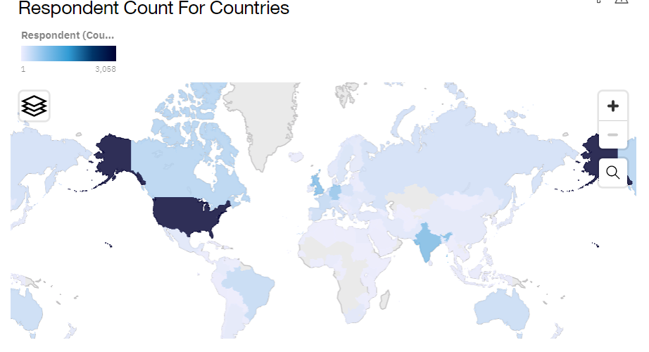

# Stack Overflow Developer Survey 2019
 

Above Bar chart shows that Javascript and HTML/CSS were the languages that were preferred in the current year and will continue to dominate in future too

Above Word Cloud chart shows the most important and frequently used platform in larger font size and in more brightly colored like Windows, Linux, AWS, and etc. Whereas, iOS,Heroku, Android, etc. were not frequently used in current time period.

Above Tree Map chart shows the platform desire next year by using size and color coding in a set of nested rectangles.

The above Hierarchy bubble chart shows the top 10 web frames developer desire to use next year. The size of each bubble shows a quantitative dimension of each data point. For example, React.js, Angular.js and Vue.js will be the most popular web frame in the coming year.

Above Map visualization shows the geographic analysis of data by using countries. This map visualization shows respondent count for countries with the darker color indicating higher respondent.

Stacked bar visualization is compare the proportional contributions for each item to the total. Above Stacked Bar chart capture Respondent Count by Gender and classified by Formal Education Level.